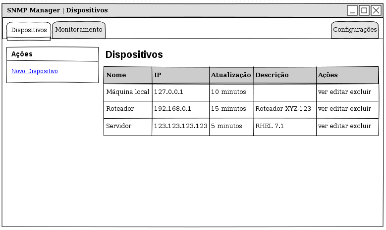
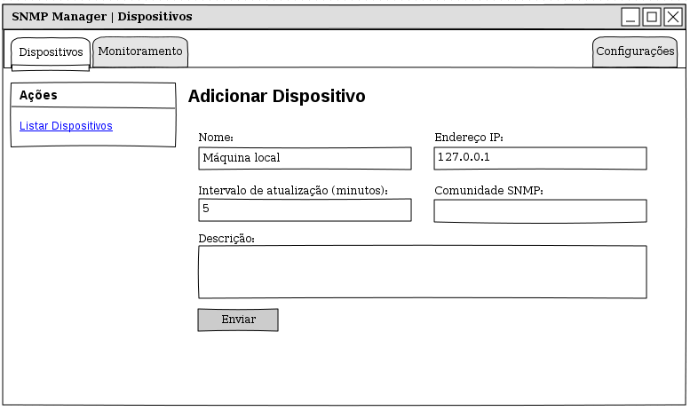
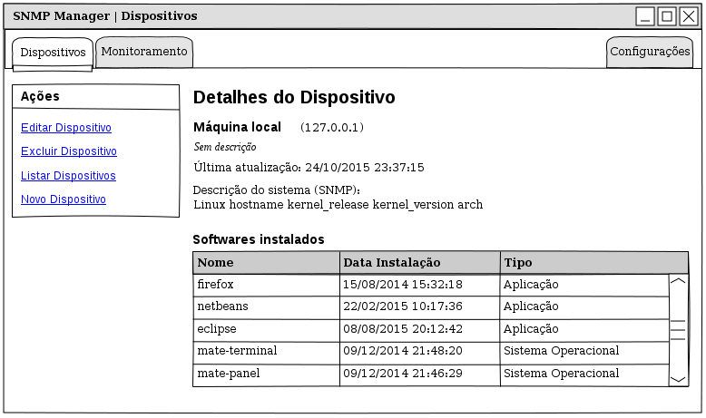
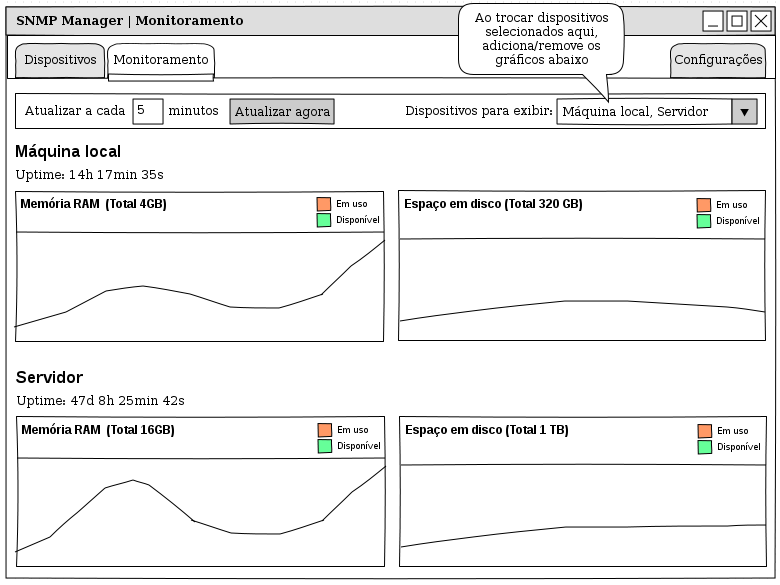

# JASMINE

JASMINE is **J**ust **A**nother **S**NMP **M**anager for **I**maginary **NE**tworks.

Trabalho de Gerência e Administração de Redes UNISC 2015/2

## Implementação

JASMINE é desenvolvido na linguagem PHP utilizando o framework [CakePHP][] 3. A biblioteca utilizada para comunicação com os agentes é a [extensão SNMP padrão do PHP][PHP-SNMP], utilizando a API orientada a objetos disponível a partir da versão 5.4 do PHP.

Outras bibliotecas utilizadas no desenvolvimento da aplicação em PHP:

* [CakePHP 3, Bootstrap Helpers][] (Apache License, Version 2.0)

A interface _web_ é desenvolvida utilizando os seguintes componentes e bibliotecas:

* [Bootstrap][] (MIT License)
* [jQuery][] (MIT License)
* [Font Awesome][] (SIL OFL 1.1 License e MIT License)
* [Flot][] (MIT License)
* [bootstrap-multiselect][] (BSD 3-Clause License)

## Interface






## Instalação

O JASMINE pode ser instalado e executado de duas formas: utilizando um container Docker ou instalando manualmente.

### Docker

A instalação pelo Docker é a mais simples, necessita de apenas um comando:

    $ docker run --name jasmine -d -p 80:80 -p 161:161 eduardoweiland/jasmine-docker

Para mais detalhes, consultar o projeto [jasmine-docker][].

### Manualmente

O JASMINE necessita de um servidor web (recomendado Apache) com suporte a PHP 5.4+ e um banco de dados MySQL. Para Ubuntu, o comando que deve ser utilizado para instalar esse pacotes é:

    $ sudo apt-get install apache2 php5 php5-cli php5-intl php5-snmp php5-mysql mysql-server

Se for utilizado o Apache, é necessário que o módulo rewrite seja habilitado para o programa funcionar corretamente. Para habilitá-lo no Ubuntu:

    $ sudo a2enmod rewrite

Outra configuração necessária do Apache é permitir que as opções globais sejam sobrescritas pelo programa. Para isso, é necessário editar o arquivo `/etc/apache2/sites-available/000-default.conf` e adicionar as seguintes linhas dentro das tags \<VirtualHost\>:

    <Directory /var/www/html/jasmine>
        AllowOverride All
    </Directory>

Depois dessas configurações serem feitas, é necessário reiniciar o Apache:

    $ sudo service apache2 restart

Agora, o primeiro passo da instalação é descompactar o código-fonte e movê-lo para um diretório acessível pelo servidor web (ex.: `/var/www/html/jasmine`).

Em seguida, deve-se instalar as dependências (bibliotecas PHP) pelo Composer utilizando os seguintes comandos:

    $ cd /var/www/html/jasmine    # deve estar dentro da pasta do código-fonte
    $ curl -sS https://getcomposer.org/installer | php
    $ php composer.phar install --no-dev --no-interaction

Um banco de dados deve ser criado no MySQL para ser utilizado pelo JASMINE. Para fazer isso no Ubuntu:

    $ mysqladmin create jasmine -u root -p

Editar o arquivo `config/app.php` e configurar a conexão com o banco de dados. **Deve ser configurada a conexão `default`**. Exemplo de como ficaria a configuração para o banco de dados local, no banco de dados `jasmine` com usuário `root` e senha `root`:

```php
// ...
'Datasources' => [
    'default' => [
        'className' => 'Cake\Database\Connection',
        'driver' => 'Cake\Database\Driver\Mysql',
        'persistent' => false,
        'host' => 'localhost',
        'port' => '3306',
        'username' => 'root',
        'password' => 'root',
        'database' => 'jasmine',
        // ...
    ]
]
```

Criar as tabelas no banco de dados utilizando o comando `cake migrations`:

    $ bin/cake migrations migrate

Após esses passos, o JASMINE deve estar instalado e acessível pelo endereço http://localhost/jasmine.

[CakePHP]: http://cakephp.org "The rapid development PHP framework"
[PHP-SNMP]: http://php.net/manual/en/book.snmp.php "PHP SNMP Documentation"
[Bootstrap]: http://getbootstrap.com "Bootstrap Front-End Framework"
[jQuery]: http://jquery.com/ "jQuery"
[Font Awesome]: http://fontawesome.io "Font Awesome The iconic font and CSS toolkit"
[Flot]: http://www.flotcharts.org "Flot: Attractive JavaScript plotting for jQuery"
[bootstrap-multiselect]: https://github.com/davidstutz/bootstrap-multiselect "Bootstrap Multiselect"
[CakePHP 3, Bootstrap Helpers]: https://holt59.github.io/cakephp3-bootstrap-helpers/ "CakePHP 3.x helpers for the Bootstrap 3"
[jasmine-docker]: https://github.com/eduardoweiland/jasmine-docker "JASMINE Docker Container"
